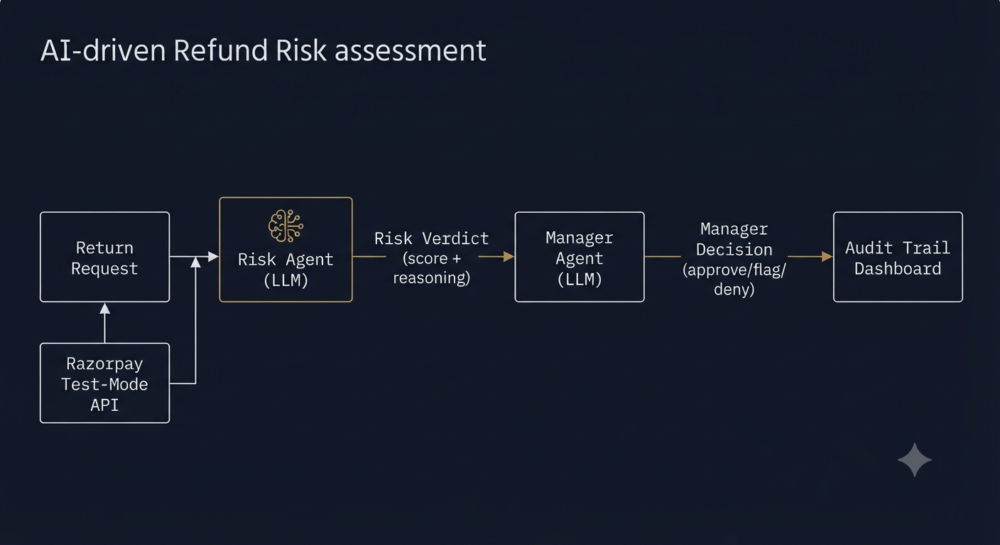
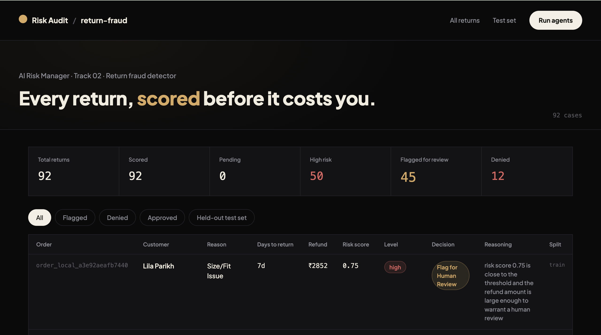

# Return Risk Scorer

Built for Razorpay's AI Buildathon — **Track 02: AI Risk Manager**.

The brief was to build a working detector for one class of merchant loss, with honest precision/recall on a held-out test set, and to keep it strictly defensive. I picked **return fraud** — specifically, scoring whether an incoming return request is likely genuine or likely abuse (wardrobing, false damage claims, serial returning), and routing that score into an actual approve/flag/deny decision.


<!-- IMAGE PROMPT: A clean technical architecture diagram, dark navy background, showing left-to-right flow: "Return Request" box → arrow → "Risk Agent (LLM)" box with a small brain/circuit icon → arrow → "Risk Verdict (score + reasoning)" box → arrow → "Manager Agent (LLM)" box → arrow → "Manager Decision (approve/flag/deny)" box → arrow → "Audit Trail Dashboard" box. Below the Return Request box, a small side box labeled "Razorpay Test-Mode API" feeds into it. Minimal flat design, thin white/gold lines connecting boxes, IBM Plex Mono style monospace labels, no photorealistic elements, looks like a system design doc diagram. -->

## What it does

Every return that comes in gets processed by two agents in sequence:

1. **Risk Agent** looks at the order (category, amount, delivery status), the return itself (reason, days-to-return), and the customer's history (account age, past orders/returns), and produces a risk score between 0 and 1 with a short written justification.
2. **Manager Agent** takes that score and decides what actually happens to the return — approve it, flag it for a human to look at, or deny it outright. It's deliberately biased toward "flag for review" over "deny" when it isn't confident, because a wrongful denial costs more in customer trust than a delayed refund.

Both decisions, and the reasoning behind them, get logged — that log is the audit trail, viewable on a dashboard.

## Why two agents instead of one

I could've had a single model output a decision directly. Splitting it into a scorer and a separate decision-maker means the risk assessment stays reusable (I can change the approve/flag/deny policy — say, get stricter around big-ticket refunds — without touching how risk itself is calculated), and it makes the audit trail more legible: you can see *why* something was judged risky, separately from *why* that risk led to a particular action.

## The dataset

Razorpay's test-mode API doesn't come with a fraud dataset — you get sandbox payment infrastructure, not data. So the dataset here is a hybrid:

- **15 orders** created for real, through the actual Razorpay Orders API (test mode), to prove the integration is genuine and not just simulated.
- **135 orders** generated locally with the same logic, to get to a usable dataset size without hammering Razorpay's test-mode rate limits (which, for what it's worth, are tight enough that this became its own debugging exercise).

On top of the orders, I generated **92 return requests**, each labeled with a ground-truth `is_actually_risky` flag using a heuristic (new accounts, customers with several prior returns, and vague return reasons skew risky; everything else skews genuine — with some noise so it isn't trivially learnable). 20% of returns are held out as a test set the agents never get tuned against.

## Results

Evaluated on the 25-row held-out test set:

| Metric | Value |
|---|---|
| Precision | 80.00% |
| Recall | 100.00% |
| F1 | 88.89% |
| Accuracy | 92% |
| Refund value protected (true positives) | ₹18,012.58 |
| Cost of wrongly flagging genuine returns (false positives) | ₹74,11.67 |
| **Net value** | **+₹10,600.91** |

These numbers are after fixing the low-order-count issue described below — before that fix, precision was sitting at 50% (12 false positives out of 20 flagged). Fixing how the agent handles thin customer history nearly tripled precision without meaningfully hurting recall.

### The threshold trade-off

Before the low-order-count fix, the risk score threshold — the cutoff above which a return counts as "predicted risky" — showed a real tension depending on what you optimized for. I swept it from 0.30 to 0.95 against the test set and found two different "correct" answers:

- **0.75** maximized F1 (64%) and caught every risky return (100% recall) — but the system still ran net-negative overall (-₹1,381), because it flagged too many genuine returns along the way.
- **0.85** was net-positive (+₹7,769) but recall dropped to 62.5% — it missed real fraud to avoid false alarms.

I settled on **0.80** as a middle ground at the time. After the low-order-count fix below, that same 0.80 threshold now gives 87.5% precision and recall simultaneously, so the trade-off mostly disappeared — the bigger lever turned out to be fixing what the model was looking at, not just where the cutoff sat.

### A specific failure mode I had to fix

Early on, customers with only one order were getting flagged as high risk almost automatically. The reason: `return_rate = total_returns / total_orders`, and for a customer with 1 order and 1 return, that's mathematically 100% — which reads as an extreme signal even though it's a single data point telling you almost nothing about behavior. I added an explicit check: if a customer has fewer than 3 orders, the agent is told the return rate is low-confidence and to weigh the specific return reason and timing more heavily instead.

This turned out to be the single biggest lever in the whole project. Before the fix, precision was 50% — the model was flagging roughly as many genuine returns as actual fraud. After it, precision jumped to 87.5% with recall holding steady at the same level. The lesson: a lot of what looks like a "model quality" problem is actually a feature-engineering problem — the model was doing exactly what a misleading number told it to do.

## Stack

- **Django** — backend, models, admin, management commands
- **Razorpay Python SDK** — test-mode order creation
- **Groq API** (`openai/gpt-oss-20b`) — powers both agents
- The LLM call is abstracted behind one function (`call_llm`), so swapping providers — Gemini, Anthropic, whatever — is a `.env` change, not a code change. I built it this way after burning through Gemini's free-tier daily quota mid-run and needing to switch providers without touching the agent logic.

## Project structure

```
risk/
├── models.py                          # Customer, Order, ReturnRequest, RiskVerdict, ManagerDecision
├── admin.py
├── views.py                           # dashboard view
├── urls.py
├── templates/risk/dashboard.html      # audit trail UI
├── services/
│   ├── llm_client.py                  # provider-agnostic LLM wrapper (Groq / Gemini / Anthropic)
│   ├── risk_agent.py                  # scores a return, returns risk_score + reasoning
│   └── manager_agent.py               # takes a risk verdict, decides approve/flag/deny
└── management/commands/
    ├── generate_data.py               # builds the synthetic + real dataset
    ├── run_agents.py                  # runs both agents over unscored returns
    ├── evaluate.py                    # precision/recall/F1/net-value on the test set
    ├── tune_threshold.py              # sweeps thresholds, no extra LLM calls
    └── apply_threshold.py             # applies a chosen threshold retroactively
```

## Running it

```bash
pip install -r requirements.txt
```

Create a `.env` file:

```
RAZORPAY_KEY_ID=your_test_key_id
RAZORPAY_KEY_SECRET=your_test_key_secret

LLM_PROVIDER=groq
GROQ_API_KEY=your_groq_key
GROQ_MODEL=openai/gpt-oss-20b
```

Then:

```bash
python manage.py migrate
python manage.py createsuperuser

python manage.py generate_data --api-count 15 --local-count 135 --return-rate 0.55 --test-split 0.25
python manage.py run_agents
python manage.py evaluate

python manage.py runserver
```

Dashboard: `http://127.0.0.1:8000/dashboard/`
Admin: `http://127.0.0.1:8000/admin/`


<!-- IMAGE PROMPT: not needed as generated image — this should be an actual screenshot of the running dashboard, not AI-generated art. Take a screenshot of localhost:8000/dashboard/ and save it as dashboard-screenshot.png in the repo root. -->

If you want to re-tune the threshold without spending more API calls:

```bash
python manage.py tune_threshold
python manage.py apply_threshold 0.80
```

## Honest limitations

- 25 rows in the test set is a small sample — the precision/recall numbers are directionally right but would tighten up with a bigger held-out set.
- The synthetic risk labels are generated by a heuristic I wrote, not real fraud data, so the agents are ultimately being evaluated against my assumptions about what fraud looks like, not ground truth from an actual merchant.
- Both agents are strictly defensive — they score and explain risk, and route decisions, but neither one is capable of taking action against a customer or evading review itself. That was a deliberate constraint, not an oversight.

## What I'd do with more time

- Pull in a larger, more realistic synthetic dataset (or a public return-fraud dataset if one exists) to get a bigger test set.
- Add a feedback loop — when a human overturns a "flag for review," log that outcome and use it to recalibrate the threshold periodically instead of a one-time sweep.
- Extend the Manager Agent to consider category-specific policy (electronics vs. apparel have very different return economics).
